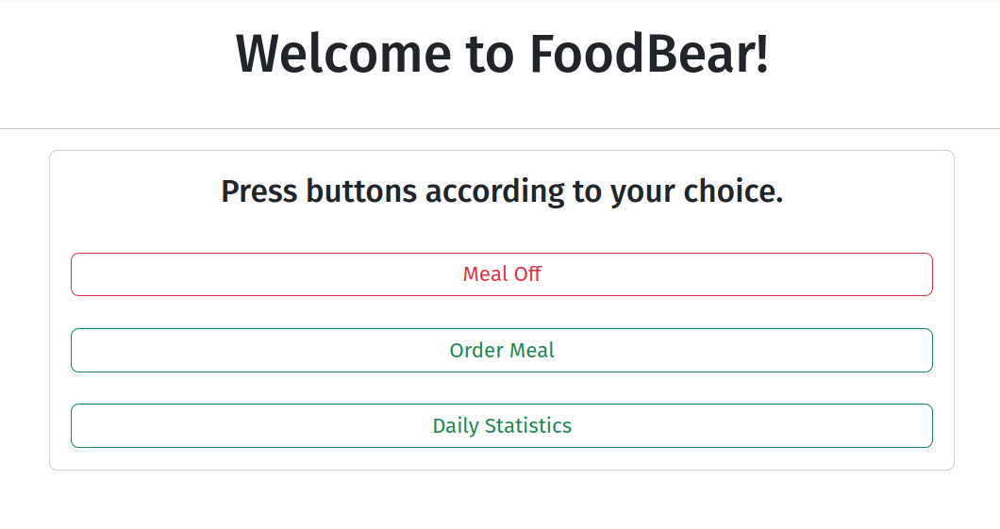
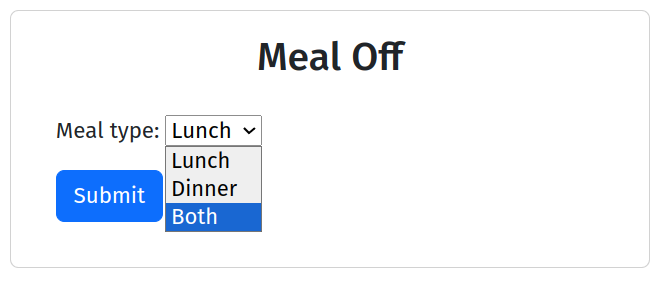
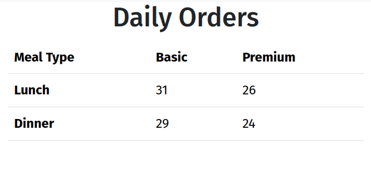

# FoodBear Online Food Delivery System

## Table of Contents

- [Introduction](#introduction)
- [Features](#features)
- [Setup and Installation](#setup-and-installation)
- [Usage](#usage)
- [Contributing](#contributing)
- [License](#license)

## Introduction

FoodBear is an online food delivery system that allows customers to subscribe to meal plans and manage their meal preferences. The system supports basic and premium categories and offers 3, 7, 15, and 30-day subscription plans. It also features an admin interface to monitor daily orders.



## Features

1. **Meal Off System**: Customers can turn off their meals (lunch and/or dinner) for specific times.



2. **Balance Reduction**: Balances are reduced according to the meals taken (lunch, dinner, or both).


3. **Admin Panel Visuals**: Admins can view daily order statistics separated by basic and premium categories for lunch and dinner.




## Setup and Installation

1. **Clone the repository**:

   ```bash
   git clone https://github.com/kaziiriad/foodbear.git
   cd foodbear
   ```
2. **Install the packages required for the project**:
    ```bash
    pip install -r requirements.txt 

3. **Run the migration commands**:
    ```bash
    python manage.py makemigrations
    python manage.py migrate
4. **Run the project**:
    ```bash
    python manage.py runsrver 0.0.0.0:8000

5. **Access the server from the url**: `https://localhost:8000`

## License
This project is licensed under the MIT License